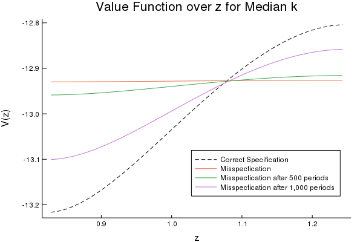
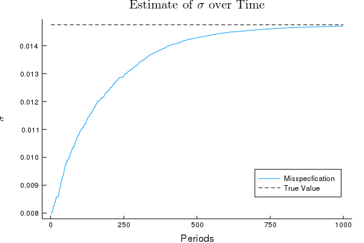
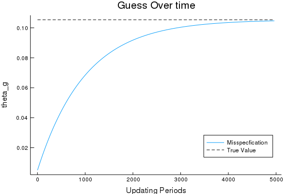
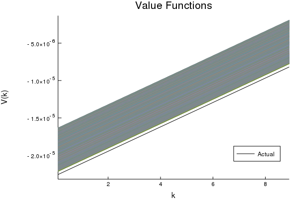
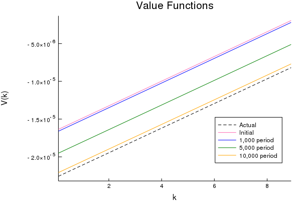
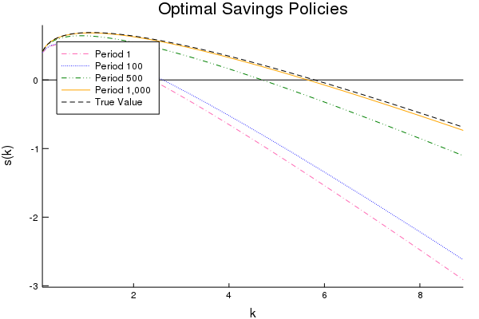
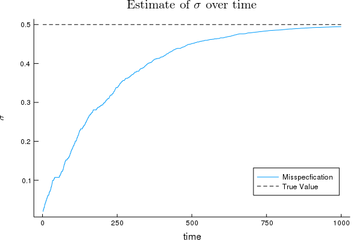

# A Simple Exogenous Learning Rule

This is some of my preliminary research on implementing learning algorithms in continuous time. 

# What is in this repository? 

Here I have some code that implements an exogenous learning rule on two simple Ramsey models. 

This repo contains the code, and figures from this simple exercise. 

# Exogenous Learning Rule Setup 
This exercise will focus on an ``exogenous" learning rule. 
In this setting we build models where our agents have a misperception of the true underlying parameters, 
then our agents receive information dumps where they get some insight into the true model parameters. 
Here our agents are trying to update their parameters to make optimal steady state decisions. 
Thus, our system is not time dependent. 
Our agents do recalculate the model for a number of periods, but these periods do not correspond to time periods in our model. 

The steady-state algorithm used in this section of the paper comes from \cite{Achdou} and is one of the more simple solution methods in this setting. 
This algorithm proceeds as follows, 

1. Compute $\partial_{k} V(\cdot)$ for all $k$ 
2. Compute the value of consumption from $c_{i} = (u')^{-1}[\partial_{k}V(\cdot)]$
3. Implement an upwind scheme to find ``correct" $\partial_{k}V(\cdot)$ 
4. Using the coefficients determined by the upwind scheme create a transition matrix for this system 
5. Solve the following system of non-linear equations 
            $$\rho V^{n+1} + \frac{V^{n+1}-V^{n}}{\Delta}= u(V) + A^{n}V^{n+1}$$
6. Iterate until $V^{n+1}-V^{n} \approx 0$
    
The upwind scheme described here selects a forward difference when we experience positive drift, i.e. positive savings, in our variable of interest, a backward difference if this drift term is negative, and selects a steady state value if we see no drift. 
In this scheme, we continue our difference algorithms for $(n+1)$ iterations until we are no longer significantly updating our value functions. 

Two models will be explored in the following sections. 
The first examines the exogenous learning rule when the unknown model parameter is part of the exogenous stochastic process.
Next, the exogenous learning rule is applied to a model with misspecification in an endogenous stochastic process for the evolution of capital stock. 

# Learning the Exogenous Process

There is a representative agent that makes consumption choices $c$ and has capital stock $k$. The state of the economy depends on the flow of capital stock. The agent has standard preferences over utility flows based on capital discounted at rate $\rho\geq 0$. This can be written as the following equation: 
\begin{equation}
    E_{0} \int_{t=0}^{\infty} e^{-\rho t} u(c_{t})
\end{equation}
Here consumption, $c_{t} \geq 0$ for all periods. 
The agent's capital stock will evolve according to the following stochastic process used in \cite{Achdou}. 
\begin{equation}
    dk_{t} = \big(z_{t}\cdot f(k_{t}) -\delta k_{t} - c_{t}\big)dt
\end{equation}
This is the continuous time analog of the typical equation for the evolution of capital stock. 
The production function used in this section is Cobb-Douglas, $f(k_{t})=k_{t}^\alpha$.
Technological progress $z_{t}$ will evolve according to the following equation. 
\begin{equation}
    d\log(z_{t}) = -\theta\log(z_{t})dt + \sigma^2dW_{t}
\end{equation}

The utility function used throughout this project will have constant relative risk aversion (CRRA). Here the CRRA parameter will be $\gamma$. 
\begin{equation}
    u(c_{t}) = \dfrac{c_{t}^{1-\gamma}}{1-\gamma}
\end{equation}
With $\gamma >0$.

# Stationary Equilibrium 
$$\rho V(k,z) = \underset{c}{\max\hspace{1ex}}u(c) + \partial_{k}V(k,z)\cdot\big(z_{t}f(k) - \delta k - c\big) + 
+\partial_{z}V(k,z)\cdot\bigg(-\theta\log(z)+\frac{\sigma^2}{2}\bigg)z
+ \partial_{zz}V(k,z)\cdot\frac{1}{2}\sigma^2 z^2$$ 

This system will not need boundary conditions on $k$ due to the solution method. 
However, we will need reflective boundaries in the $z$-dimension. 
These boundaries will be, 
\begin{eqnarray}
     \partial_{z}V(k,z_{1}) = 0 & \text{for all $k$} \\ 
     \partial_{z}V(k,z_{J}) = 0 & \text{for all $k$}
\end{eqnarray}
In this setting $1$ and $J$ correspond to the first and last values in the state space for $z$ (or the smallest and largest possible values $z$ can take).
The conditions above are typical reflective boundaries as in \cite{DIXIT}. 

The agents in this simple model hold an incorrect belief about the diffusion process for technological progress. 
In this setting with exogenous learning, they predict that the diffusion process is given by the equation below. 
\begin{equation}
        d\log(z_{t}) = -\theta_{g}\log(z_{t})dt + \sigma_{g}^2 dW_{t}
\end{equation} 
In this model the agent believes that $\theta$ is smaller than the true value, 
and that $\sigma$ is much larger than the true value. 

To test how a learning process could evolve in this environment we first introduce an exogenous learning process. 
Since the process is exogenous, 
the agents will repeatedly solve the steady state of the HJB with different amounts of information at each period. 
In each one of these periods, there is a chance that the agents will have a chance to gain more information. 
The information will be given to an agent with a draw from a standard Bernoulli distribution and the agents will update their estimate of both parameters using the following equations. 
\begin{eqnarray}\label{update2}
    \theta_g = \theta_g + 0.001(\theta-\theta_g) \\ 
    \sigma_g = \sigma_g + 0.001(\sigma-\sigma_g)
\end{eqnarray}

# Exogenous Process Results

Below are the convergence results for the exogenous learning rule in this setting. 
The following figure displays the value function over z and k. 
Looking at the convergence in for the value function over z for a median value of k we can see clear convergence, here our value function starts off flat and develops the correct slope and curvature as our updating procedure continues. 
However, after 10,000 periods we are still some distance from the true value function. 
Convergence over k for a median value of z is less interesting. 
In this case there is appropriate convergence; however, the difference between the misspecification and the true value is much smaller than in the z dimension. 

  

 

The misspecified parameters, $\theta$ and $\sigma$, converge as we would expect. 
Below is a graph of the values of $\sigma$ and $\theta$ at each updating period, i.e. each period where new information is obtained. 
This figure shows that our parameters converge how we would expect.

   

This exercise displayed the type of convergence we would expect in this setting. 
Thus, we expect that learning rules would perform in a predictable manner in a stochastic continuous time setting. 

# Learning the Endogenous Process
After examining the exogenous learning rule's impacts on a model with a misspecified exogenous process, 
we investigate a model with a misspecified endogenous process. 
In this model, we have a diffusion process that summarizes the evolution of capital stock. 
Misspecification in this diffusion process impacts optimal savings and therefore the optimal consumption choice in the model. 
Thus, an incorrect specification of this process directly impacts our equilibrium choices. 
Furthermore, a poor consumption choice directly impacts the drift term in our diffusion process. 

In our endogenous process model, there is a representative agent that makes consumption choices $c$ and has capital stock $k$. 
The state of the economy depends on the flow of capital stock. 
The agent has standard preferences over utility flows based on capital discounted at rate $\rho\geq 0$. This can be written as the following equation: 
\begin{equation}
    E_{0} \int_{t=0}^{\infty} e^{-\rho t} u(c_{t})
\end{equation}
Here consumption, $c_{t} \geq 0$ for all periods. The agent's capital stock will evolve according to the following stochastic process used in Merton (1975). 
\begin{equation}
    dk_{t} = \big(f(k_{t}) - (\delta + n - \sigma^2)k_{t} - c_{t}\big)dt + \sigma k_{t} dW_{t}
\end{equation}
Here $n$ measures the growth of the work force and $dW_{t}$ is the increment of a Wiener process. In this setting, $f(k) - (\delta + \sigma^2)k - c$ summarizes the drift of capital and $\sigma k$ describes the variance. \newline

# Stationary Equilibrium
\begin{equation}
    \rho V(k) = \underset{c}{\max\hspace{1ex}}u(c) + V'(k)\cdot\big(f(k) - (\delta + n -\sigma^2)k - c\big) +\frac{1}{2} V''(k)\cdot(\sigma k)
\end{equation}

The agents in this simple model hold an incorrect belief about the diffusion process for capital stock. 
In this setting with exogenous learning they predict that the diffusion process is given by equation \eqref{wrong}. 
\begin{equation}\label{wrong}
dk = \big(f(k) - (\delta +n - \sigma_g^2)k - c\big)dt + \sigma_g k dW_{t}
\end{equation} 

In this model the agent believes that the parameter $\sigma$ is smaller than it should be, $\sigma_{g} < \sigma$
With this misspecification, the agent believes the drift is larger than it should be \textit{and} the variance is smaller than the true variance of the process. 

To test how a learning process could evolve in this environment we first introduce an exogenous learning process. 
Since the process is exogenous the agents will repeatedly solve the steady state of the HJB with different amounts of information at each period. 
In each one of these periods, there is a chance that the agents will have a chance to gain more information. 
The information will be given to the agent with a draw from a standard Bernoulli distribution and the agents will update their estimate of $\sigma_g$ according to the equation below.
\begin{equation}\label{update}
    \sigma_g = \sigma_g + 0.001(\sigma-\sigma_g) 
\end{equation}
The updating process will continue for 10,000 periods. 

# Endogenous Process Results
Below are several results, the figures on the left show all the output from all 10,000 iterations of the endogenous learning algorithm. 
Figures to the right display select output from different periods of the iteration. 

 

 

Using the endogenous learning process, the value function converges to the true estimate over time. 
In this setting convergence is slow and even after 10,000 periods, the value function is still a small distance from the true value. 
Convergence is equally slow for some measures such as savings. 

 

 

From these figures, we can see that the savings policies appear to converge more quickly to the true policy than the value functions converge to the true steady state estimates. 
This is likely due to the fact that optimal savings policies don't depend as strongly on the parameter $\sigma$. 
While $\sigma$ does impact the calculations of the savings policies it is only one part of savings decision. 
This parameter impacts the value function more directly since it will affect the evolution of the system and the algorithm's choice of implementing a forward difference or backward difference for calculating the derivative of the value function. 

Our prediction of $\sigma$ converges in an expected way. 

 

Verifying that our updating rule works as expected. 
Even after 10,000 iterations the guess for $\sigma$ is .005 away from the true parameter value, 
this is why our value functions and optimal savings policies have not completely converged to their true values. 

# Summary 
Our exogenous learning rules perform well in the stochastic continuous-time steady state calculations. 
This is encouraging because it means that we can expect some of the familiar results from discrete time learning to carry over in our continuous setting. 
Although, the results in this section are not particularly stunning there are several extensions to this simple learning rule that may yield more interesting results.
Looking at this exogenous learning rule in a heterogeneous agent setting may allow for more feedback through the system KF equation, thus yielding less predictable results. 
A heterogeneous agent model creates this additional feedback through internal pricing frictions that do not exist in our representative agent model. 
Now that we have explored learning in this steady state setting through this exogenous learning rule, we can move on to building a model for a time-dependent system. 
